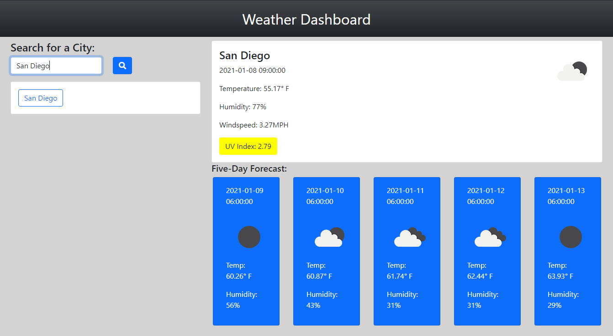

# Weather Dashboard



This site was made to tell the user about a given city's weather. Upon opening the webpage, the user will find an input field. Any city typed into the input field will be put into an API and todays weather will be shown on screen along with temperature, humidity, windspeed, and UV index. Below that the user will find a 5-day forecast where they can find the date, the weather, the temperature, and the humidity. If the user wants to search a new city in the input field they can. The days weather report and the 5 day forecast will also be updated. As of right now you can't click on the city history buttons to re-route you to that city, but i hope to add it in the future!

## Snips of code

Below is a code snippet of the local storage that is stored in an array then turned into a string to be able to be stored in local storage.

```
function addHistory(cityToSave) {
    cityArr.push(cityToSave);
    localStorage.setItem("cityHistory", JSON.stringify(cityArr));
    showHistory();
}
```

The code snippet below shows how the UV Index was obtained, and how the background color was changed.

```
var UVqueryURL = "http://api.openweathermap.org/data/2.5/uvi?lat=" + lat + "&lon=" + lon + "&appid=3d8a9db33d6081c4a896f43ab9165e4d"

$.ajax({
        url: UVqueryURL,
        method: "GET"
    }).then(function(responseUV) {
        UVIndex.text("UV Index: " + responseUV.value)
        if (responseUV.value < 2) {
            UVIndex.addClass("safe")
        }
        else if (responseUV.value < 5) {
            UVIndex.addClass("beware")
        }
        else {
            UVIndex.addClass("danger")
        }

        console.log(responseUV)
    });
```

## Built With

* [HTML](https://developer.mozilla.org/en-US/docs/Web/HTML)
* [CSS](https://developer.mozilla.org/en-US/docs/Web/CSS)
* [JS](https://www.javascript.com/)
* [GitHub](https://github.com/)
* [Git](https://git-scm.com/)
* [Bootstrap](https://getbootstrap.com/docs/5.0/getting-started/introduction/)
* [Openweathermap's API](https://openweathermap.org/api)

## Deployed Link

* [See Live Site](https://pting1995.github.io/weather/)

## Authors

* Peter Ting

- [Link to Github](https://github.com/Pting1995)
- [Link to LinkedIn](https://www.linkedin.com/in/pting002/)

## License

This project is licensed under the MIT License 

## Acknowledgments

* Thank you to UC Berkeley's Extension Bootcamp for giving me the opportunity to work on this project!